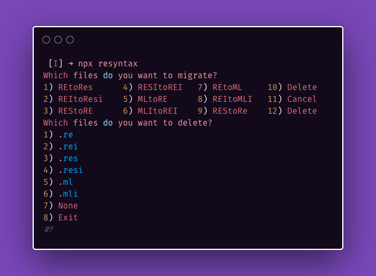

[](https://www.npmjs.com/package/resyntax)

# [npx resyntax](https://git.io/resyntax)

 Migrate files between `.re` `.rei` `.res` `.resi` `.ml` `.mli` syntaxes for [Ocaml](https://ocaml.org/),
 [ReasonML](https://git.io/reasonml) and [Rescript](https://rescript-lang.org/) syntaxes.

 Doesn't always work so check your output. Especially for conversions from `.res` to `.re` or when convertion functors. See https://github.com/rescript-lang/syntax/issues/264;

```sh
npx resyntax
```

Gets you:



<details>
<summary>Summary</summary>
```sh
 [I] ➜ npx resyntax
Which files do you want to migrate?
1) REtoRes      4) RESItoREI   7) REtoML     10) Delete
2) REItoResi    5) MLtoRE      8) REItoMLI   11) Cancel
3) REStoRE      6) MLItoREI    9) REStoRe    12) Delete
Which files do you want to delete?
1) .re
2) .rei
3) .res
4) .resi
5) .ml
6) .mli
7) None
8) Exit
#?
```
</details>


### Other Tools

[npx bsconfig.json](https://git.io/bsconfig.json)

[npx resgitignore](https://github.com/idkjs/resgitignore)

[npx resattributes](https://github.com/idkjs/resattributes)

###[Share on Twitter...](https://twitter.com/share?url=https://dev.to/idkjs/npx-resyntax-2574)

